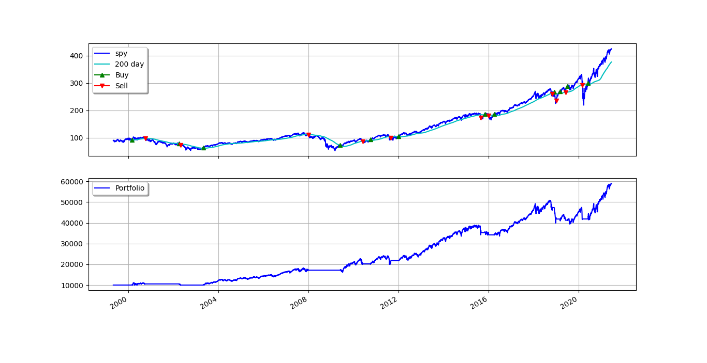

# SPY-200MA-backtest

The strategy aims to capture buy and sell signals based on the crossover of the SPY's closing price and its 200-day SMA. It buys when the price crosses above the SMA on the last trading day of the month and sells when the price crosses below the SMA. The strategy uses a simple execution model without considering slippage or transaction costs in detail. 


### Note

* initial cash amount is set to $10,000
* startdate='2000-01-01', enddate='2021-12-31'


### Results 
```
Final portfolio value: $58943.68
Cumulative returns: 489.44 %
Max. drawdown: 22.40 %
Longest drawdown duration: 1253 days, 0:00:00

Total trades: 11
Avg. profit: $2896
Profits std. dev.: $5717
Max. profit: $13523
Min. profit: $-5522
Avg. return: 17 %
Returns std. dev.: 27 %
Max. return: 74 %
Min. return: -12 %

Profitable trades: 7
Avg. profit: $5660
Profits std. dev.: $5281
Max. profit: $13523
Min. profit: $551
Avg. return: 30 %
Returns std. dev.: 27 %
Max. return: 74 %
Min. return:  1 %

Unprofitable trades: 4
Avg. loss: $-1941
Losses std. dev.: $2079
Max. loss: $-5522
Min. loss: $-562
Avg. return: -5 %
Returns std. dev.:  4 %
Max. return: -1 %
Min. return: -12 %
```

